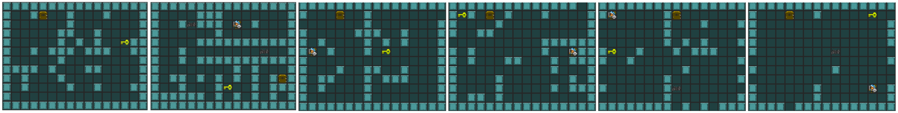

# Generative Playing Networks
Research Into Learning to Generate Environments through Interaction and Play


Paper can be found here: https://arxiv.org/pdf/2002.05259.pdf

# Install

* Python 3
* [PyTorch](http://pytorch.org/)
* [GVGAI GYM](https://github.com/rubenrtorrado/GVGAI_GYM/tree/ascii)
* [Pytorch-A2C-PPO-ACKTR-GAIL](https://github.com/ikostrikov/pytorch-a2c-ppo-acktr-gail)

In order to install requirements, follow:

```bash
#Most requirements
pip install -e .

# PyTorch
conda install pytorch torchvision -c soumith

# GVGAI GYM (Game Environments)
git clone https://github.com/rubenrtorrado/GVGAI_GYM.git
cd GVGAI_GYM
git checkout ascii
pip install -e .

# RL Library and dependency
git clone https://github.com/openai/baselines.git
cd baselines
pip install -e .

git clone https://github.com/ikostrikov/pytorch-a2c-ppo-acktr-gail.git
cd pytorch-a2c-ppo-acktr-gail
pip install -e .
```

## Sample Output



## Disclaimer
Current default parameters are different from the paper and as such the results will look different.
To get the results from the paper, run 'paper_run.py' instead.
